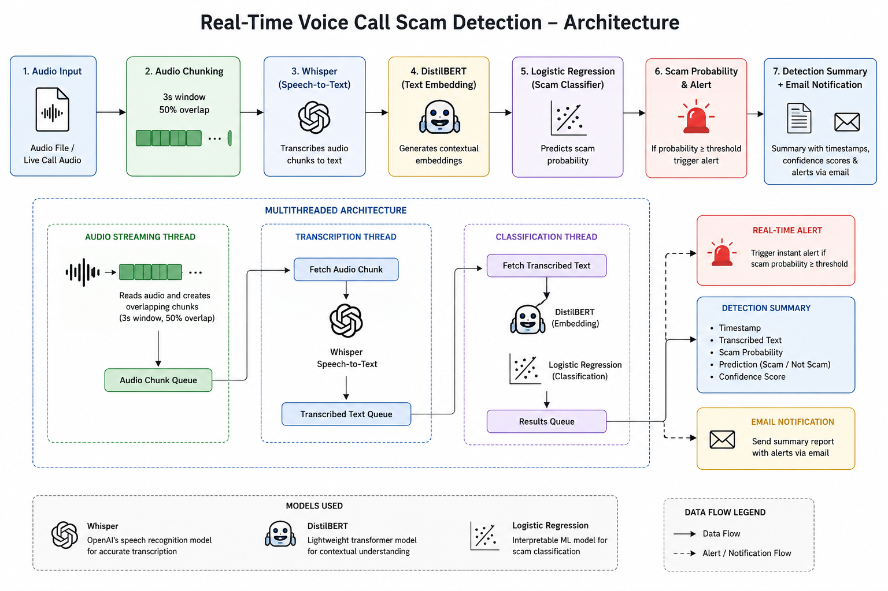

<h1> Real-Time Voice Call Scam Detection</h1>

<p>
  
  
  
  
  
  
  
</p>

> ### NLP Project — VIT Chennai, November 2025  
> **Adithya Ajikumar • Joseph Alex Valluvassery • S Saran**

## The Problem

Most existing scam detection systems rely on caller blacklists, metadata analysis, or post-call investigation. These approaches often fail against modern voice scams that use social engineering, fake identities, and dynamic phone numbers. By the time a scam is reported or manually reviewed, the financial or personal damage may already be done.

Voice-based fraud is rapidly increasing across banking, telemarketing, and digital communication platforms. The real challenge is not just identifying scam calls — it is detecting fraudulent intent while the conversation is happening.

This project answers a different question than traditional spam filters:

> Not *“Was this number suspicious?”*  
> But *“Is this conversation behaving like a scam in real time?”*

## What This Project Does

This project is a real-time AI-powered voice scam detection system that:

1. Converts live or pre-recorded voice calls into text using Whisper
2. Processes conversational context using DistilBERT embeddings
3. Classifies scam-related intent using Logistic Regression
4. Detects suspicious speech patterns in real time
5. Generates scam probability scores for each audio segment
6. Triggers instant alerts when scam confidence exceeds a threshold
7. Produces a complete detection summary with timestamps and confidence scores
8. Sends automated email notifications containing scam alerts and analysis results

---

## How It Works

```text
Audio File → Audio Chunking (3s window, 50% overlap)
           → Whisper (Speech-to-Text)
           → DistilBERT (Contextual Text Embedding)
           → Logistic Regression (Scam Classification)
           → Scam Probability & Real-Time Alert
           → Detection Summary + Email Notification
```

The system runs on a multithreaded architecture with three parallel threads:

- **Audio Streaming Thread** — Feeds overlapping audio chunks into a queue at timed intervals
- **Transcription Thread** — Converts audio chunks into text using Whisper
- **Classification Thread** — Generates DistilBERT embeddings and classifies scam probability using Logistic Regression

The architecture enables near real-time processing with low latency, making the system suitable for intelligent fraud monitoring and voice-based cybersecurity applications.

## Architecture



## Models Used

| Component | Model | Purpose |
|---|---|---|
| Speech Recognition | OpenAI Whisper (tiny) | Audio → Text transcription |
| Text Embedding | DistilBERT (Hugging Face) | 768-dimensional semantic embeddings |
| Classifier | Logistic Regression | Scam / Not-Scam prediction |

DistilBERT retains approximately **97% of BERT's performance** with **40% fewer parameters**, enabling faster inference and near real-time processing.

A context window of **3 consecutive chunks** is concatenated before embedding to capture multi-sentence scam patterns and conversational context.

---

## Features

-  Real-time simulation with overlapping 3-second audio windows
-  Configurable alert threshold (default: `0.6` confidence)
-  Automated email alerts with complete detection summary
-  Full transcript output with per-chunk scam probabilities
-  Supports CPU and CUDA GPU execution
-  Supports `.wav`, `.mp3`, and `.flac` audio formats
-  Multithreaded pipeline for low-latency processing
-  Real-time scam probability monitoring and alert generation
